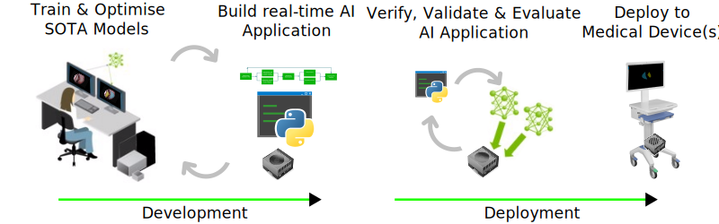
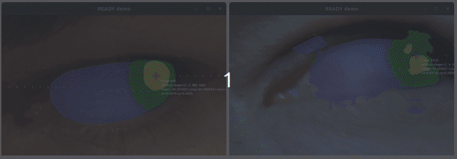

<div style="text-align: center;" align="center">
  
  <h1> :robot: :eye: READY: REal-time Ai Diagnosis for nYstagmus </h1>
</div>

## :eyeglasses: Overview
This repository contains documentation and code for the project `READY: REal-time Ai Diagnosis for nYstagmus`.

## :school_satchel: Getting started
* :page_facing_up: [Docs](docs/README.md) Getting started, debugging, testing, demos.
* :floppy_disk: [Data](data/): [openEDS](data/openEDS/); [mobious](data/mobious/); [novel](data/novel/)
* :brain: [models](docs/models) trained in [cricket](docs/cricket); 
* :computer: [holoscan-sdk](docs/holoscan/): [apis](docs/holoscan/apis.md); [apis_webrtc_ready](docs/holoscan/apis_webrtc_ready.md)

## :nut_and_bolt: Installation
[CONTRIBUTING](CONTRIBUTING.md) is a good starting point for setting up the GitHub repository, managing dependencies, and guiding you through the development installation and debugging process.

### Dev installation
```
uv venv --python 3.12
source .venv/bin/activate
uv pip install -e ".[test,learning,model_optimisation]"
uv pip list --verbose
pre-commit run -a
```
See further details for installation [here](docs).

## :clapper: Demos
Python-based application were implemented with [holoscan-sdk](docs/holoscan/README.md), where  holoscan-sdk was built on host Laptop computer with NVIDIARTXA2000-8GB.
The [UNet](src/ready/models/unet.py) models were trained in cricket with A100-80GB, using either [~27K images of 1 channel](data/openEDS/README.md) or [~1K colour images of 3 channels](data/mobious/README.md). 

| Animation(s) | Data, Model(s) |
| --- | --- |
| [webrtc_client.py](src/ready/apis/holoscan/webrtc_ready/webrtc_client.py) with model _weights_15-12-24_07-00-10-sim-BHWC.onnx, running `drop_frames_op` at different `PeriodicCondition(self, recess_period=period_ns)` 1 to 30 Hz and improving backpressure mechanism. | [:nut_and_bolt: Launch & debug](docs/holoscan/apis_webrtc_ready.md) <br/> [:hourglass: flowbenchmarking](data/webrtc/flow_benchmarking/) <br/> [:hourglass_flowing_sand: glass2glass_latency](data/webrtc/glass_to_glass_latency/) |
|  [ready.py](src/ready/apis/holoscan/ready/python/ready.py) with model _weights_10-09-24_06-35-14-sim-BHWC.onnx trained with ~1K images and tested with (right) three frames repeated 10 times each to create a 30fps video and (left) with v4l2 `/dev/video4` usb-endoscope camera with resolution of width640xheight480) |  [:nut_and_bolt: Launch & debug](docs/holoscan/apis_ready.md) <br/> [:floppy_disk: Mobious dataset](data/mobious/) <br/> [:brain: Models](data/mobious/models/) |

See more demos [here](docs/README.md#demos). 
See [apis](docs/holoscan/apis.md) for detailed instructions on running applications.

## :octocat: Cloning repository
1. Generate your SSH keys as suggested [here](https://docs.github.com/en/github/authenticating-to-github/generating-a-new-ssh-key-and-adding-it-to-the-ssh-agent)
2. Setup you commit signature verification as shown [here](https://docs.github.com/en/authentication/managing-commit-signature-verification/about-commit-signature-verification#ssh-commit-signature-verification)
3. Clone the repository by typing (or copying) the following lines in a terminal
```
mkdir $HOME/repositories/oocular && cd $HOME/repositories/oocular
git clone git@github.com:oocular/ready.git
```
