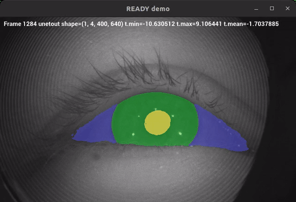

<div style="text-align: center;" align="center">
  
  <h1> :robot: :eye: READY: REal-time Ai Diagnosis for nYstagmus </h1>
</div>


## :eyeglasses: Overview
This repository contains documentation and code for `REal-time Ai Diagnosis for nYstagmus` project.

## Getting started
See [docs/README.md](docs/README.md).

## Demos
`READY` demo aplication ([ready.py](/src/ready/apis/holoscan/ready/python/ready.py)) is running in a local host LaptopGPU with NVIDIARTXA2000-8GB using local-built holoscan-sdk. 
[UNet](src/ready/models/unet.py) was trained in cricket A100-40GB with [27.4K images of 1 channel](data/openEDS/README.md). 



## :octocat: Cloning repository
* Generate your SSH keys as suggested [here](https://docs.github.com/en/github/authenticating-to-github/generating-a-new-ssh-key-and-adding-it-to-the-ssh-agent)
* Clone the repository by typing (or copying) the following lines in a terminal
```
git clone git@github.com:UCL/ready.git
```

