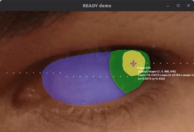
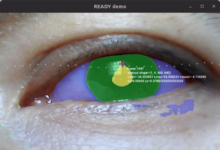

<div style="text-align: center;" align="center">
  
  <h1> :robot: :eye: READY: REal-time Ai Diagnosis for nYstagmus </h1>
</div>

## :eyeglasses: Overview
This repository contains documentation and code for the project `READY: REal-time Ai Diagnosis for nYstagmus`.

## :school_satchel: Getting started
* :page_facing_up: [Docs](docs/README.md)
* :floppy_disk: [Data](data/): [openEDS](data/openEDS/); [mobious](data/mobious/); [novel](data/novel/)
* :brain: [models](docs/models) trained in [cricket](docs/cricket); 
* :computer: [holoscan-sdk](docs/holoscan/)
* :recycle: [CONTRIBUTING](CONTRIBUTING.md)

## :clapper: Demos
Python-based application, [ready.py](src/ready/apis/holoscan/ready/python/ready.py), was implemented with [holoscan-sdk](docs/holoscan/README.md), where  holoscan-sdk was built on host Laptop computer with NVIDIARTXA2000-8GB.
The [UNet](src/ready/models/unet.py) models were trained in cricket with A100-40GB, using either [~27K images of 1 channel](data/openEDS/README.md) or [~1K colour images of 3 channels](data/mobious/README.md). See [apis](docs/holoscan/apis.md) for detailed instructions on running the application.

| Animation | Data, Model(s) |
| --- | --- |
|      
**Fig.**  [API: ready.py](src/ready/apis/holoscan/ready/python/ready.py) with model _weights_10-09-24_06-35-14-sim-BHWC.onnx trained with ~1K images and tested with (right) three frames repeated 10 times each to create a 30fps video and (left) with v4l2 `/dev/video4` usb-endoscope camera with resolution of width640xheight480). | :floppy_disk: [Mobious dataset](data/mobious/); :brain: [Models](data/mobious//models/) | 

See more demos [here](docs/README.md#demos)

## :octocat: Cloning repository
* Generate your SSH keys as suggested [here](https://docs.github.com/en/github/authenticating-to-github/generating-a-new-ssh-key-and-adding-it-to-the-ssh-agent)
* Clone the repository by typing (or copying) the following lines in a terminal
```
git clone git@github.com:UCL/ready.git
```