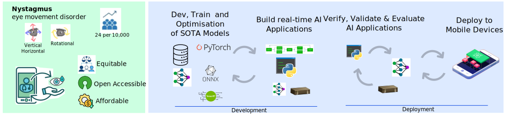

<div style="text-align: center;" align="center">
  
  <h1> :robot: :eye: READY: REal-time Ai Diagnosis for nYstagmus </h1>
</div>


## :eyeglasses: Overview
This repository contains documentation and code for the `REal-time Ai Diagnosis for nYstagmus` project.

## :school_satchel: Getting started
* :floppy_disk: [data](data/)
* :page_facing_up: [docs](docs/README.md).

## :hospital: Demos
`READY` demo aplication ([ready.py](/src/ready/apis/holoscan/ready/python/ready.py)) is running in a local host LaptopGPU with NVIDIARTXA2000-8GB using local-built holoscan-sdk. 
[UNet](src/ready/models/unet.py) was trained in cricket with A100-40GB  and using [27.4K images of 1 channel](data/openEDS/README.md). 


| Animation | Data, Model(s), API |
| --- | --- |
|  **Fig.** Initial demo using UNET with OpenEDS datsets. Video has 3 frames copied 10 times to create a 30 frame per second video. | [DATA: OpenEDS](data/openEDS);  [MODEL: UNET](data/openEDS/models); [API: ready.py d98c497](https://github.com/UCL/ready/blob/d98c497392ba7d91e9218fa5b73c75c629e3d29b/src/ready/apis/holoscan/ready/python/ready.py) 
|  **Fig.** Pupil segmentation was masked to compute its centroid values as coordinates. Centroid values for x are plotted as cummulative time series of 30 samples. Streamed video consist of different 6 frames copied 5 times to create a 30 frames per second video. | [DATA: OpenEDS](data/openEDS); [MODEL: UNET](data/openEDS/models);  [API: ready.py b44515a](https://github.com/UCL/ready/blob/b44515a70727620187f20ea19c50c77f4cacbad6/src/ready/apis/holoscan/ready/python/ready.py)  |


## :octocat: Cloning repository
* Generate your SSH keys as suggested [here](https://docs.github.com/en/github/authenticating-to-github/generating-a-new-ssh-key-and-adding-it-to-the-ssh-agent)
* Clone the repository by typing (or copying) the following lines in a terminal
```
git clone git@github.com:UCL/ready.git
```

