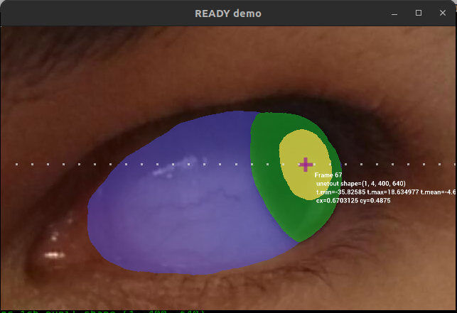
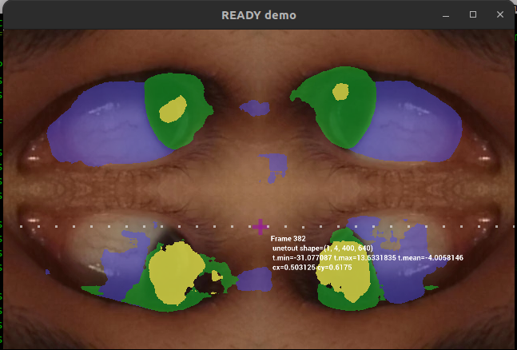
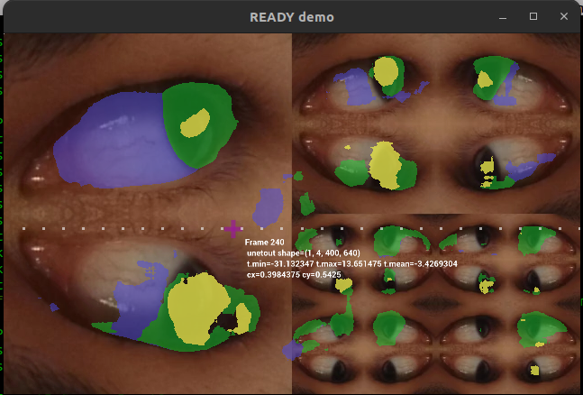

# Real-time Inference with holoscan-sdk 

## api with _weights_10-09-24_06-35-14-sim-BHWC.onnx using video_30_duplicated_frames_of_1_1i_Ll_1_channels3



Logs
```
#clear && python ready.py -c ready-mobious.yaml -d /workspace/volumes/ready/data/mobious -m _weights_10-09-24_06-35-14-sim-BHWC.onnx -l logger.log -df TRUE -s replayer
 \/ \/ \/ \/ \/ \/ 
   PreInfoOp  
tensor.shape=(400, 640, 3)
tensor_1ch.shape=(400, 640)
 \/ \/ \/ \/ \/ \/ \/ \/ \/ \/ 
   FormatInferenceInputOp  
**
tensor.shape=(400, 640, 3)
tensor.min 1.0
tensor.max 249.04705810546875
tensor.mean 61.3033447265625
**
tensor_.shape=(1, 3, 400, 640)
tensor_.min 1.0
tensor_.max 249.04705810546875
tensor_.mean 61.303375244140625
**
tensor_1ch.shape=(1, 400, 640)
tensor1ch.min 13.7960786819458
tensor1ch.max 249.04705810546875
tensor1ch.mean 90.33840942382812
**
tensor_1CH.shape=(1, 1, 400, 640)
tensor_1CH.min 13.7960786819458
tensor_1CH.max 249.04705810546875
tensor_1CH.mean 90.33840942382812
**
tensor_1Ch.shape=(1, 400, 640, 1)
tensor_1Ch.min 13.7960786819458
tensor_1Ch.max 249.04705810546875
tensor_1Ch.mean 90.33840942382812
 \/ \/ \/ \/ \/ \/ \/ \/ \/ \/ 
   PostInferenceOperator  
unet_out tensor.shape=(1, 4, 400, 640)
tensor.min -26.610116958618164
tensor.max 18.82499885559082
tensor.mean -10.790827751159668
tensor_1ch_pupil.shape=(1, 400, 640)
tensor_1ch_pupil_sq.shape=(400, 640)
uint8
mask_pupil_bool.shape (400, 640)
mask_pupil_bool.dtype bool
centroid: [195.35639707 429.09022908]
```

## inference_of__weights_10-09-24_06-35-14-sim-BHWC_with_video_30_duplicated_frames_of_four-frames-in-one_channels3.png



## inference_of__weights_10-09-24_06-35-14-sim-BHWC_with_video_30_duplicated_frames_of_fractal-frames-in-one_channels3.png



