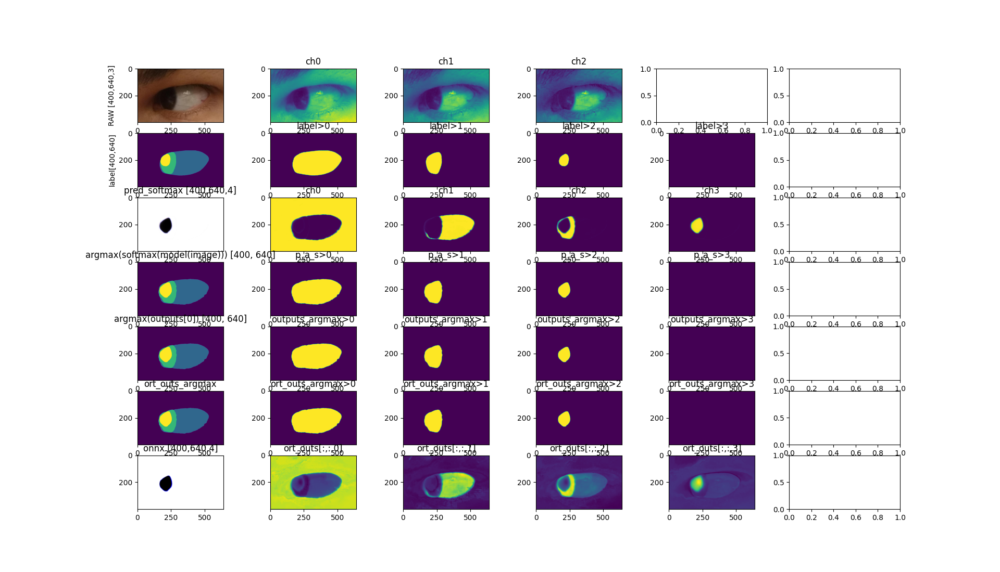

# Models

## Local path for models and size at `~/datasets/mobious/weights/trained_models_in_cricket`
```
tree -h
[4.0K]  .
└── [ 89M]  _weights_27-08-24_05-23_trained_10epochs_8batch_1143lentrainset.pth

├── [ 89M]  _weights_02-09-24_21-02.pth
```


## Preparations
### Conversion to ONNX (using .pth models)
```
#cd $HOME/ready
conda activate readyVE
export PYTHONPATH=.
#python src/ready/apis/convert_to_onnx.py -p $HOME/Desktop/nystagmus-tracking/datasets/mobious/weights/trained_models_in_cricket -i _weights_27-08-24_05-23_trained_10epochs_8batch_1143lentrainset.pth
#python src/ready/apis/convert_to_onnx.py -p $HOME/Desktop/nystagmus-tracking/datasets/mobious/weights/trained_models_in_cricket -i _weights_02-09-24_21-02.pth
#python src/ready/apis/convert_to_onnx.py -p $HOME/Desktop/nystagmus-tracking/datasets/mobious/weights/trained_models_in_cricket -i _weights_02-09-24_22-24_trained10e_8batch_1143trainset.pth
#python src/ready/apis/convert_to_onnx.py -p $HOME/Desktop/nystagmus-tracking/datasets/mobious/weights/trained_models_in_cricket -i _weights_03-09-24_19-16.pth
python src/ready/apis/convert_to_onnx.py -p $HOME/Desktop/nystagmus-tracking/ready/data/mobious/models -i _weights_04-09-24_16-31.pth
python src/ready/apis/convert_to_onnx.py -p $HOME/Desktop/nystagmus-tracking/ready/data/mobious/models -i _weights_10-09-24_03-46-29.pth
python src/ready/apis/convert_to_onnx.py -p $HOME/Desktop/nystagmus-tracking/ready/data/mobious/models -i _weights_10-09-24_04-50-40.pth
python src/ready/apis/convert_to_onnx.py -p $HOME/Desktop/nystagmus-tracking/ready/data/mobious/models -i _weights_10-09-24_06-35-14.pth
#python src/ready/apis/convert_to_onnx.py -p $HOME/Desktop/nystagmus-tracking/ready/data/mobious/models -i <ADD_MODEL_NAME>.pth
```

### ONNX symplification (using .onnx models)
```
#python src/ready/apis/sim_onnx.py -p $HOME/Desktop/nystagmus-tracking/datasets/mobious/weights/trained_models_in_cricket -m _weights_27-08-24_05-23_trained_10epochs_8batch_1143lentrainset.onnx
#python src/ready/apis/sim_onnx.py -p $HOME/Desktop/nystagmus-tracking/datasets/mobious/weights/trained_models_in_cricket -m _weights_02-09-24_21-02.onnx
#python src/ready/apis/sim_onnx.py -p $HOME/Desktop/nystagmus-tracking/datasets/mobious/weights/trained_models_in_cricket -m _weights_02-09-24_22-24_trained10e_8batch_1143trainset.onnx
#python src/ready/apis/sim_onnx.py -p $HOME/Desktop/nystagmus-tracking/datasets/mobious/weights/trained_models_in_cricket -m _weights_03-09-24_19-16.onnx
python src/ready/apis/sim_onnx.py -p $HOME/Desktop/nystagmus-tracking/ready/data/mobious/models -m _weights_04-09-24_16-31.onnx
python src/ready/apis/sim_onnx.py -p $HOME/Desktop/nystagmus-tracking/ready/data/mobious/models -m _weights_10-09-24_03-46-29.onnx
python src/ready/apis/sim_onnx.py -p $HOME/Desktop/nystagmus-tracking/ready/data/mobious/models -m _weights_10-09-24_04-50-40.onnx
python src/ready/apis/sim_onnx.py -p $HOME/Desktop/nystagmus-tracking/ready/data/mobious/models -m _weights_10-09-24_06-35-14.onnx
#python src/ready/apis/sim_onnx.py -p $HOME/Desktop/nystagmus-tracking/ready/data/mobious/models -m <ADD_MODEL_NAME>.onnx
```

## Rebinding model to new nodes (NCHW to NHWC)
```
conda activate readyVE
cd ~/ready/data/mobious/models
#or cd ~/ready/data/openEDS/models

##TODO add bash to install onnx_graphsurgeon
##pip install onnx_graphsurgeon --index-url https://pypi.ngc.nvidia.com

##TODO user one single name

#python ../../../src/ready/apis/holoscan/utils/graph_surgeon.py _weights_27-08-24_05-23_trained_10epochs_8batch_1143lentrainset-sim.onnx _weights_27-08-24_05-23_trained_10epochs_8batch_1143lentrainset-sim-BHWC.onnx 3 400 640
#python ../../../src/ready/apis/holoscan/utils/graph_surgeon.py _weights_02-09-24_21-02-sim.onnx _weights_02-09-24_21-02-sim-BHWC.onnx 3 400 640
#python ../../../src/ready/apis/holoscan/utils/graph_surgeon.py _weights_02-09-24_22-24_trained10e_8batch_1143trainset-sim.onnx _weights_02-09-24_22-24_trained10e_8batch_1143trainset-sim-BHWC.onnx 3 400 640
#python ../../../src/ready/apis/holoscan/utils/graph_surgeon.py _weights_03-09-24_19-16-sim.onnx _weights_03-09-24_19-16-sim-BHWC.onnx 3 400 640
#python ../../../src/ready/apis/holoscan/utils/graph_surgeon.py _weights_04-09-24_16-31-sim.onnx _weights_04-09-24_16-31-sim-BHWC.onnx 4 400 640 # [error] [core.cpp:106] Load Engine: Error in deserializing cuda engine. 
python ../../../src/ready/apis/holoscan/utils/graph_surgeon.py _weights_04-09-24_16-31-sim.onnx _weights_04-09-24_16-31-sim-BHWC.onnx 3 400 640
python ../../../src/ready/apis/holoscan/utils/graph_surgeon.py _weights_10-09-24_03-46-29-sim.onnx _weights_10-09-24_03-46-29-sim-BHWC.onnx 3 400 640
python ../../../src/ready/apis/holoscan/utils/graph_surgeon.py _weights_10-09-24_04-50-40-sim.onnx _weights_10-09-24_04-50-40-sim-BHWC.onnx 3 400 640
python ../../../src/ready/apis/holoscan/utils/graph_surgeon.py _weights_10-09-24_06-35-14-sim.onnx _weights_10-09-24_06-35-14-sim-BHWC.onnx 3 400 640
#python ../../../src/ready/apis/holoscan/utils/graph_surgeon.py <ADD>-sim.onnx <ADD_MODEL>-BHWC.onnx 3 400 640
```

## Inference in local device (NVIDIARTXA20008GBLaptopGPU)
```
cd $HOME_REPO
conda activate readyVE
export PYTHONPATH=. #$HOME/ready #$HOME/<ADD_REPO_PATH>

# copy models to ready/data/mobious/sample-frames
cp $HOME/Desktop/nystagmus-tracking/datasets/mobious/weights/trained_models_in_cricket/_weights_04-09-24_16-31.pth $HOME/Desktop/nystagmus-tracking/ready/data/mobious/models

#inference mobious
python src/ready/apis/inference_mobious.py
vim src/ready/apis/inference_mobious.py
```

* inference_mobious__weights_10-09-24_03-46-29


## Properties with https://netron.app/
### 27-08-24_05-23
* `_weights_27-08-24_05-23_trained_10epochs_8batch_1143lentrainset.onnx`

```
format: ONNX v8
producer: pytorch 2.3.1
version: 0
imports: ai.onnx v16
graph: main_graph

name: input
tensor: float32[batch_size,3,400,640]
name: output
tensor: float32[batch_size,4,400,640]
```

* `_weights_27-08-24_05-23_trained_10epochs_8batch_1143lentrainset-sim.onnx`
```
name: input
tensor: float32[batch_size,3,400,640]
name: output
tensor: float32[batch_size,4,400,640]
```


* `_weights_27-08-24_05-23_trained_10epochs_8batch_1143lentrainset-sim-BHWC.onnx`
```
format ONNX v10
producer pytorch 2.3.1
version 0 
imports ai.onnx v16
graph main_graph

name: INPUT__0
tensor: float32[1,400,640,3]
output_old
name: output_old
tensor: float32[batch_size,4,400,640]
```


### 02-09-24_21-02
* `_weights_02-09-24_21-02.onnx`
```
input
name: input
tensor: float32[batch_size,3,400,640]
output
name: output
tensor: float32[batch_size,4,400,640]
```

* `_weights_02-09-24_21-02-sim.onnx`
```
input
name: input
tensor: float32[batch_size,3,400,640]
output
name: output
tensor: float32[batch_size,4,400,640]
```

* `_weights_02-09-24_21-02-sim-BHWC.onnx`
```
INPUT__0
name: INPUT__0
tensor: float32[1,400,640,3]
output_old
name: output_old
tensor: float32[batch_size,4,400,640]
```

### 02-09-24_22-24

* `_weights_02-09-24_22-24_trained10e_8batch_1143trainset.onnx`
```
input
name: input
tensor: float32[batch_size,3,400,640]
output
name: output
tensor: float32[batch_size,4,400,640]
```
* `_weights_02-09-24_22-24_trained10e_8batch_1143trainset-sim.onnx`
```
input
name: input
tensor: float32[batch_size,3,400,640]
output
name: output
tensor: float32[batch_size,4,400,640]
```

* `_weights_02-09-24_22-24_trained10e_8batch_1143trainset-sim-BHWC.onnx`

```
INPUT__0
name: INPUT__0
tensor: float32[1,400,640,3]
output_old
name: output_old
tensor: float32[batch_size,4,400,640]
```


### 02-09-24_22-24
* `_weights_03-09-24_19-16.onnx`
```
input
name: input
tensor: float32[batch_size,3,400,640]
output
name: output
tensor: float32[batch_size,4,400,640]
```
* `_weights_03-09-24_19-16-sim.onnx`
```

input
name: input
tensor: float32[batch_size,3,400,640]
output
name: output
tensor: float32[batch_size,4,400,640]

```
* `_weights_03-09-24_19-16-sim-BHWC.onnx`
```

INPUT__0
name: INPUT__0
tensor: float32[1,400,640,3]
output_old
name: output_old
tensor: float32[batch_size,4,400,640]

```

