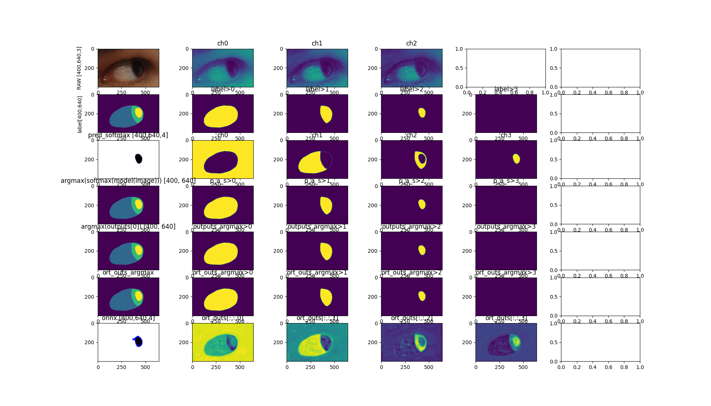

# Models

## Model path
```
#cd ~/datasets/mobious/weights/trained_models_in_cricket
tree -h
├── [2.1K]  loss_values_14-12-24_19-25-26.csv
├── [ 235]  performance_14-12-24_19-25-26.json
├── [ 89M]  _weights_14-12-24_19-25-26.onnx
├── [ 89M]  _weights_14-12-24_19-25-26.pth
└── [ 89M]  _weights_14-12-24_19-25-26-sim.onnx
```

## Preparations
### Conversion to ONNX (using .pth models) and ONNX symplification 
```
cd $HOME_REPO
export PYTHONPATH=.
python src/ready/apis/convert_to_onnx_and_simplify_it.py -p <MODEL_PATH> -n <ADD_MODEL_NAME>.pth
```

## Inference in local device (NVIDIARTXA20008GBLaptopGPU)
```
cd $HOME_REPO
export PYTHONPATH=. 
python src/ready/apis/inference_mobious.py -p <MODEL_PATH> -m  <ADD_MODEL_NAME>.pth
```

* inference_mobious__weights_10-09-24_03-46-29


## Rebinding model to new nodes (NCHW to NHWC)
```
cd $HOME_REPO
export PYTHONPATH=.
python src/ready/apis/holoscan/utils/graph_surgeon.py -p <MODEL_PATH> -m <model_name.pth> -c <channels> -h <height> -w <width>
```

## Model properties with https://netron.app/


### _weights_14-12-24_19-25-26.pth
* `_weights_14-12-24_19-25-26.onnx`
```
format: ONNX v8
producer: pytorch 2.4.1
version: 0
imports: ai.onnx v16
graph: main_graph

input
name: input
tensor: float32[batch_size,3,400,640]
output
name: output
tensor: float32[batch_size,4,400,640]

```
* `_weights_14-12-24_19-25-26-sim.onnx`
```

format: ONNX v8
producer: pytorch 2.4.1
version: 0
imports: ai.onnx v16
graph: main_graph

input
name: input
tensor: float32[batch_size,3,400,640]
output
name: output
tensor: float32[batch_size,4,400,640]
```


* `_weights_14-12-24_19-25-26-sim-BHWC.onnx`
```

format: ONNX v10
producer: pytorch 2.4.1
version: 0
imports: ai.onnx v16
graph: main_graph

INPUT__0
name: INPUT__0
tensor: float32[1,400,640,3]
output_old
name: output_old
tensor: float32[batch_size,4,400,640]
```


<details>

<summary>See various examples of model properties</summary>

### 27-08-24_05-23
* `_weights_27-08-24_05-23_trained_10epochs_8batch_1143lentrainset.onnx`

```
format: ONNX v8
producer: pytorch 2.3.1
version: 0
imports: ai.onnx v16
graph: main_graph

name: input
tensor: float32[batch_size,3,400,640]
name: output
tensor: float32[batch_size,4,400,640]
```

* `_weights_27-08-24_05-23_trained_10epochs_8batch_1143lentrainset-sim.onnx`
```
name: input
tensor: float32[batch_size,3,400,640]
name: output
tensor: float32[batch_size,4,400,640]
```


* `_weights_27-08-24_05-23_trained_10epochs_8batch_1143lentrainset-sim-BHWC.onnx`
```
format ONNX v10
producer pytorch 2.3.1
version 0 
imports ai.onnx v16
graph main_graph

name: INPUT__0
tensor: float32[1,400,640,3]
output_old
name: output_old
tensor: float32[batch_size,4,400,640]
```


### 02-09-24_21-02
* `_weights_02-09-24_21-02.onnx`
```
input
name: input
tensor: float32[batch_size,3,400,640]
output
name: output
tensor: float32[batch_size,4,400,640]
```

* `_weights_02-09-24_21-02-sim.onnx`
```
input
name: input
tensor: float32[batch_size,3,400,640]
output
name: output
tensor: float32[batch_size,4,400,640]
```

* `_weights_02-09-24_21-02-sim-BHWC.onnx`
```
INPUT__0
name: INPUT__0
tensor: float32[1,400,640,3]
output_old
name: output_old
tensor: float32[batch_size,4,400,640]
```

### 02-09-24_22-24

* `_weights_02-09-24_22-24_trained10e_8batch_1143trainset.onnx`
```
input
name: input
tensor: float32[batch_size,3,400,640]
output
name: output
tensor: float32[batch_size,4,400,640]
```
* `_weights_02-09-24_22-24_trained10e_8batch_1143trainset-sim.onnx`
```
input
name: input
tensor: float32[batch_size,3,400,640]
output
name: output
tensor: float32[batch_size,4,400,640]
```

* `_weights_02-09-24_22-24_trained10e_8batch_1143trainset-sim-BHWC.onnx`

```
INPUT__0
name: INPUT__0
tensor: float32[1,400,640,3]
output_old
name: output_old
tensor: float32[batch_size,4,400,640]
```


### 02-09-24_22-24
* `_weights_03-09-24_19-16.onnx`
```
input
name: input
tensor: float32[batch_size,3,400,640]
output
name: output
tensor: float32[batch_size,4,400,640]
```
* `_weights_03-09-24_19-16-sim.onnx`
```

input
name: input
tensor: float32[batch_size,3,400,640]
output
name: output
tensor: float32[batch_size,4,400,640]

```
* `_weights_03-09-24_19-16-sim-BHWC.onnx`
```

INPUT__0
name: INPUT__0
tensor: float32[1,400,640,3]
output_old
name: output_old
tensor: float32[batch_size,4,400,640]

```

</details>
