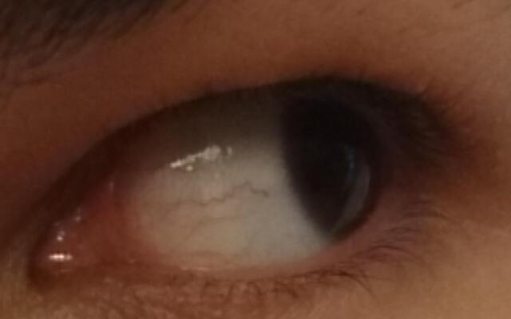

# Videos

## Converting image to mp4 video to `gxf_entities`

### Single image frame
* `640wX400h`


### 2 convert image to frames

```
cd ~/ready/data/bash-scripts
conda activate readyVE #(in local machine)
bash frames_to_mp4_to_gxf.bash $HOME/Desktop/nystagmus-tracking/ready/data/mobious/videos $HOME/Desktop/nystagmus-tracking/ready/data/mobious/sample-frames jpg 30 1_1i_Ll_1 640 400 3
bash frames_to_mp4_to_gxf.bash $HOME/Desktop/nystagmus-tracking/ready/data/mobious/videos $HOME/Desktop/nystagmus-tracking/ready/data/mobious/sample-frames png 30 four-frames-in-one 640 400 3
bash frames_to_mp4_to_gxf.bash $HOME/Desktop/nystagmus-tracking/ready/data/mobious/videos $HOME/Desktop/nystagmus-tracking/ready/data/mobious/sample-frames png 30 fractal-frames-in-one 640 400 3
```

### 3 video properties
```
ffmpeg -i video_30_duplicated_frames_of_1_1i_Ll_1_channels3.mp4 
#  Stream #0:0(und): Video: h264 (High) (avc1 / 0x31637661), yuvj420p(pc, bt470bg/unknown/unknown), 640x400 [SAR 1:1 DAR 8:5], 116 kb/s, 30 fps, 30 tbr, 15360 tbn, 60 tbc (default)

ffmpeg -i video_30_duplicated_frames_of_fractal-frames-in-one_channels3.mp4
#  Stream #0:0(und): Video: h264 (High 4:4:4 Predictive) (avc1 / 0x31637661), yuv444p, 640x400 [SAR 1:1 DAR 8:5], 201 kb/s, 30 fps, 30 tbr, 15360 tbn, 60 tbc (default)
```


## Multiple frames
1. Select images
* 1_1i_Ls_1.jpg (center)
* 1_1i_Lr_2.jpg (left)
* 1_1i_Ll_2.jpg (rigth)

2. Run bash script
```
cd ~/ready/data/bash-scripts
conda activate readyVE #(in local machine)
bash multi_frames_to_mp4_to_gxf.bash $HOME/Desktop/nystagmus-tracking/ready/data/mobious/sample-frames/test640x400/images $HOME/Desktop/nystagmus-tracking/ready/data/mobious/videos 1_1i_Ls_1 1_1i_Lr_2 1_1i_Ll_2 jpg
```


