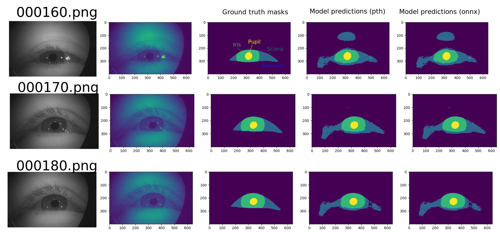

# openEDS
> OpenEDS (Open Eye Dataset) is a large scale data set of eye-images captured using a virtual-reality (VR) head mounted display mounted with two synchronized eyefacing cameras at a frame rate of 200 Hz under controlled illumination.
> This dataset is compiled from video capture of the eye-region collected from 152 individual participants and is divided into four subsets: 
	(i) 12,759 images with pixel-level annotations for key eye-regions: iris, pupil and sclera 
	(ii) 252,690 unlabelled eye-images, 
	(iii) 91,200 frames from randomly selected video sequence of 1.5 seconds in duration and 
	(iv) 143 pairs of left and right point cloud data compiled from corneal topography of eye regions collected from a subset, 143 out of 152, participants in the study.

https://www.kaggle.com/datasets/soumicksarker/openeds-dataset/data

## Local datasets path
cd $HOME/datasets/openEDS

```
train/
	images #27,431 #640 x 400 pixels #153.3 kB #PNG image
	labels #27,431 #(400, 640) #*npy
	masks  #27,431 #640 x 400 pixels #1.6 kB #PNG image

test/
	images #2,744
	labels #2,744
	masks #2,744

validation/
	images #2,744
	labels #2,744
	masks #2,744
```

## Previewing data
The following images is created using [inference.py](../../src/ready/apis/inference.py)


* Inference for three frames

