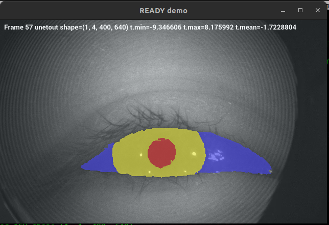
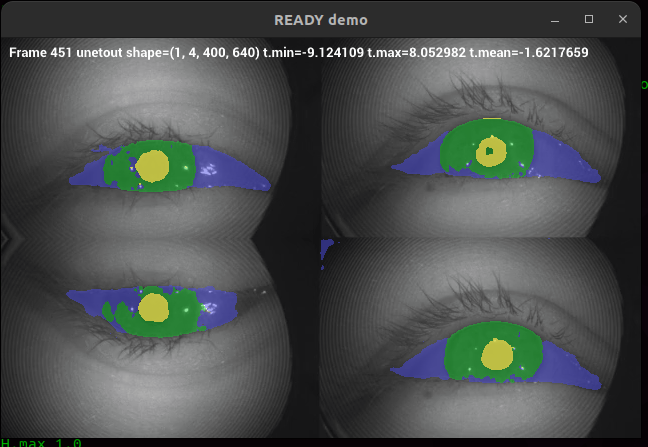
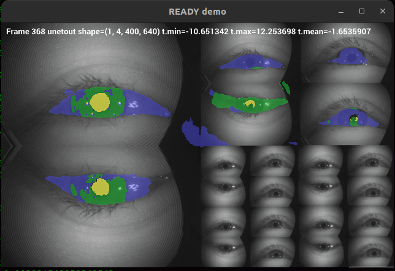

# Real-time Inference with holoscan-sdk

## Holocan-sdk api (val-000160-640wX400h)




## Four images scaled to 640wX400h



## Fractal images in a scaled resolution of 640wX400h




## inference_of_weights_10-09-24_23-53-45_in_holoscan_api_with_video_30_duplicated_frames_of_val-000180-640wX400h_channels3


Logs
```
# clear && python ready.py -d /workspace/volumes/ready/data/openEDS -m _weights_10-09-24_23-53-45-sim-BHWC.onnx -l logger.log -df TRUE -s replayer #v4l2
 \/ \/ \/ \/ \/ \/ 
   PreInfoOp  
tensor.shape=(400, 640, 3)
tensor_1ch.shape=(400, 640)
 \/ \/ \/ \/ \/ \/ \/ \/ \/ \/ 
   FormatInferenceInputOp  
**
tensor.shape=(400, 640, 3)
tensor.min 0.05098039656877518
tensor.max 1.0
tensor.mean 0.28184184432029724
**
tensor_.shape=(1, 3, 400, 640)
tensor_.min 0.05098039656877518
tensor_.max 1.0
tensor_.mean 0.28184178471565247
**
tensor_1ch.shape=(1, 400, 640)
tensor1ch.min 0.05098039656877518
tensor1ch.max 1.0
tensor1ch.mean 0.2818412184715271
**
tensor_1CH.shape=(1, 1, 400, 640)
tensor_1CH.min 0.05098039656877518
tensor_1CH.max 1.0
tensor_1CH.mean 0.2818412184715271
**
tensor_1Ch.shape=(1, 400, 640, 1)
tensor_1Ch.min 0.05098039656877518
tensor_1Ch.max 1.0
tensor_1Ch.mean 0.2818412184715271
 \/ \/ \/ \/ \/ \/ \/ \/ \/ \/ 
   PostInferenceOperator  
unet_out tensor.shape=(1, 4, 400, 640)
tensor.min -5.484012126922607
tensor.max 7.095162868499756
tensor.mean -2.7057809829711914
tensor_1ch_pupil.shape=(1, 400, 640)
tensor_1ch_pupil_sq.shape=(400, 640)
uint8
mask_pupil_bool.shape (400, 640)
mask_pupil_bool.dtype bool
centroid: [227.44644959 339.82110632]

```


