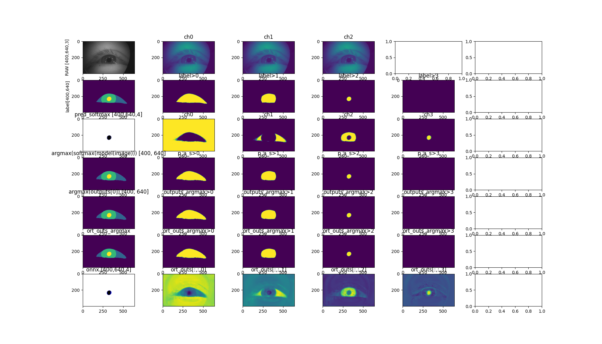
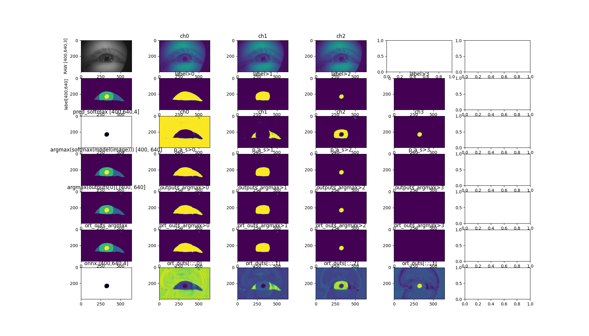

# Models

## Local path for models and size
```
cd $HOME/datasets/openEDS/weights
$ tree -h
.
├── [  89M]  ADD_MODEL_NAME_VAR.onnx
├── [  89M]  model.pth
└── [ 268M]  o.pth
```

## Transfer 
* Copying model to local host
```
scp ccxxxxx@cricket.rc.ucl.ac.uk:~/datasets/openEDS/weights/* ~/Desktop/nystagmus-tracking/datasets/openEDS/weights/trained_models_in_cricket
#100%   89MB   6.2MB/s   00:14 
#100%  268MB   6.2MB/s   00:43
```


## Preparations
* Conversion to ONNX
```
cd $HOME/ root path of repo
conda activate readyVE
export PYTHONPATH=.
python src/ready/apis/convert_to_onnx.py -p $HOME/Desktop/nystagmus-tracking/datasets/openEDS/weights/trained_models_in_cricket -i model-5jul2024.pth
python src/ready/apis/convert_to_onnx.py -p $HOME/Desktop/nystagmus-tracking/datasets/openEDS/weights/trained_models_in_cricket -i model3ch-23jul2024t0716.pth
python src/ready/apis/convert_to_onnx.py -p $HOME/Desktop/nystagmus-tracking/ready/data/openEDS/models -i _weights_10-09-24_23-53-45.pth
#python src/ready/apis/convert_to_onnx.py -p $HOME/Desktop/nystagmus-tracking/ready/data/openEDS/models -i <modelname>.pth

```

* ONNX symplification
```
python src/ready/apis/sim_onnx.py -p $HOME/Desktop/nystagmus-tracking/datasets/openEDS/weights/trained_models_in_cricket -m model-5jul2024.onnx
python src/ready/apis/sim_onnx.py -p $HOME/Desktop/nystagmus-tracking/datasets/openEDS/weights/trained_models_in_cricket -m model3ch-23jul2024t0716.onnx
python src/ready/apis/sim_onnx.py -p $HOME/Desktop/nystagmus-tracking/ready/data/openEDS/models -m _weights_10-09-24_23-53-45.onnx
#python src/ready/apis/sim_onnx.py -p $HOME/Desktop/nystagmus-tracking/ready/data/openEDS/models -m <modelname>.onnx
```
OR https://convertmodel.com/#input=onnx&output=onnx


## Inference 
Inference for three frames

```
cd $HOME_REPO
conda activate readyVE
export PYTHONPATH=. #$HOME/ready #$HOME/<ADD_REPO_PATH>

#inference openEDS
python src/ready/apis/inference.py
vim src/ready/apis/inference.py
```


* inference_openEDS_model3ch-23jul2024t0716.png



* inference_of_weights_10-09-24_23-53-45_on000180.png

```

```

## Properties with https://netron.app/

* unet-model.onnx
```
format ONNX v8
producer pytorch 2.3.1
version 0
imports ai.onnx v16
graph main_graph

input
name: input
tensor: float32[batch_size,1,400,640]

output
name: output
tensor: float32[batch_size,4,400,640]
```


* Identity model 


## Rebinding model to new nodes (NCHW to NHWC)
```
conda activate readyVE
cd ~/ready/data/openEDS/models

pip install onnx_graphsurgeon --index-url https://pypi.ngc.nvidia.com
python ../../../src/ready/apis/holoscan/utils/graph_surgeon.py model-5jul2024-sim.onnx model-5jul2024-sim-BHWC.onnx 1 400 640
python ../../../src/ready/apis/holoscan/utils/graph_surgeon.py model3ch-23jul2024t0716-sim.onnx model3ch-23jul2024t0716-sim-BHWC.onnx 3 400 640
python ../../../src/ready/apis/holoscan/utils/graph_surgeon.py _weights_10-09-24_23-53-45-sim.onnx _weights_10-09-24_23-53-45-sim-BHWC.onnx 3 400 640
#python ../../../src/ready/apis/holoscan/utils/graph_surgeon.py <modelname>-sim.onnx <modelname>-sim-BHWC.onnx 3 400 640
```

* `model-5jul2024-sim.onnx` 

name: input
tensor: float32[batch_size,1,400,640]
output
name: output
tensor: float32[batch_size,4,400,640]


* `model-5jul2024-sim-BHWC.onnx`
```
INPUT__0
name: INPUT__0
tensor: float32[1,400,640,1]
output_old
name: output_old
tensor: float32[batch_size,4,400,640]
```


* `model3ch-23jul2024t0716-sim.onnx` at https://netron.app/
```
input
name: input
tensor: float32[batch_size,3,400,640]
output
name: output
tensor: float32[batch_size,4,400,640]
```

* `model3ch-23jul2024t0716-sim-BHWC.onnx` https://netron.app/
```
INPUT__0
name: INPUT__0
tensor: float32[1,400,640,3]
output_old
name: output_old
tensor: float32[batch_size,4,400,640]
```


