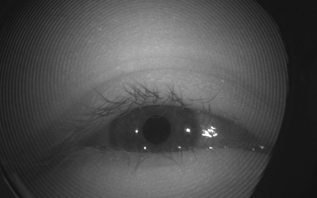

# Videos

## Converting image to mp4 video to `gxf_entities`
### (1) Frame image of `640wX400h`



### (2) Workflow for different frames in `docker images of clara-agx` or `local machine`
WARNING WITH WIDTH, HEIGHT AND CHANNELS!!!
```
conda activate readyVE #In local machine
bash frames_to_mp4_to_gxf.bash sample-frames png 30 <image> 640 400 3
bash frames_to_mp4_to_gxf.bash sample-frames png 30 validation-026580-640widthx400height 640 400 3
bash frames_to_mp4_to_gxf.bash sample-frames png 30 train-008068-640widthx400height 640 400 3
bash frames_to_mp4_to_gxf.bash sample-frames png 30 val-000160-640wX400h 640 400 3
bash frames_to_mp4_to_gxf.bash sample-frames png 30 val-000170-640wX400h 640 400 3
#
bash frames_to_mp4_to_gxf.bash sample-frames png 30 val-000180-640wX400h 640 400 1 #1channels
bash frames_to_mp4_to_gxf.bash sample-frames png 30 val-000180-640wX400h 640 400 3 #3channels
#
bash frames_to_mp4_to_gxf.bash sample-frames png 30 val-000180-640wX400h_rgb 640 400 1 #1channels
bash frames_to_mp4_to_gxf.bash sample-frames png 30 val-000180-640wX400h_rgb 640 400 3 #3channels
```

### (3) Moving video files to shared workspace in clara-agx and removing files from local path

### Video clips
```
#ffmpeg -i video_30_duplicated_frames_of_validation-026580-640widthx400height.mp4 
video_30_duplicated_frames_of_validation-026580-640widthx400height.mp4 [57M]
 Stream #0:0(und): Video: h264 (High) (avc1 / 0x31637661), yuvj420p(pc), 640x400, 452 kb/s, 30 fps, 30 tbr, 15360 tbn, 60 tbc (default)
```


## References
https://github.com/nvidia-holoscan/holoscan-sdk/tree/main/scripts#convert_video_to_gxf_entitiespy
https://docs.nvidia.com/holoscan/sdk-user-guide/gxf/gxf_by_example.html
https://docs.nvidia.com/clara-holoscan/archive/clara-holoscan-0.3.0/gxf/index.html

