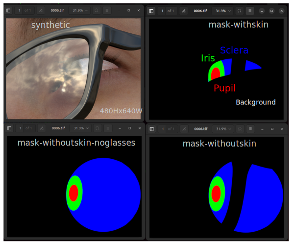

# RIT-eye datasets

S-Natural [32.8GB] 24 folders with tiff files including synthetic, mask-withskin, mask-withoutskin-noglasses and mask-withoutskin and one .p which seems like a numpy file. 
Download from  https://cs.rit.edu/~cgaplab/RIT-Eyes/official_release/s-natural.zip

## Sample frames from `0006` for folder 12 (8,005 items, totalling 1.4 GB)

### Filenames
```
├── [9.9K]  mask-withoutskin_0000.tif #[480Hx640W]
├── [9.9K]  mask-withoutskin-noglasses_0000.tif #[480Hx640W]
├── [6.5K]  mask-withskin_0000.tif #[480Hx640W]
└── [682K]  synthethic_0000.tif #[480Hx640W]
```

### Screenshot




## References
* https://cs.rit.edu/~cgaplab/RIT-Eyes/
* https://arxiv.org/pdf/2006.03642
