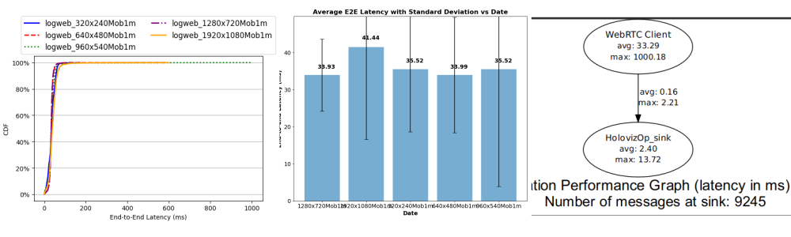

# webrtc with mobile

## Simple workflow

### Flow benchmarking
* Run [api_webrtc_ready](../../../docs/holoscan/apis_webrtc_ready.md) to generate logs
```
bash webrtc_ready.bash logweb_320x240Mob1m.log PUBLIC OFF
bash webrtc_ready.bash logweb_640x480Mob1m.log PUBLIC OFF
bash webrtc_ready.bash logweb_960x540Mob1m.log PUBLIC OFF
bash webrtc_ready.bash logweb_1280x720Mob1m.log PUBLIC OFF
bash webrtc_ready.bash logweb_1920x1080Mob1m.log PUBLIC OFF
```

* Create path and move for files
```
mkdir -p logsmobile-200324
mv logweb_* logsmobile-200324
```


* Analyse single logfiles
```
cd $HOME/repositories/oocular/ready/data/webrtc/flow_benchmarking
bash ../../../scripts/flow_benchmarking/A_analyse_logfile.bash $HOME/datasets/ready/webrtc/logsmobile-200324 logweb_320x240Mob1m.log
bash ../../../scripts/flow_benchmarking/A_analyse_logfile.bash $HOME/datasets/ready/webrtc/logsmobile-200324 logweb_640x480Mob1m.log
bash ../../../scripts/flow_benchmarking/A_analyse_logfile.bash $HOME/datasets/ready/webrtc/logsmobile-200324 logweb_960x540Mob1m.log
bash ../../../scripts/flow_benchmarking/A_analyse_logfile.bash $HOME/datasets/ready/webrtc/logsmobile-200324 logweb_1280x720Mob1m.log
bash ../../../scripts/flow_benchmarking/A_analyse_logfile.bash $HOME/datasets/ready/webrtc/logsmobile-200324 logweb_1920x1080Mob1m.log
```

* B analyses multiple log files
```
bash ../../../scripts/flow_benchmarking/B_analyse_bar_plot_avg_datewise.bash $HOME/datasets/ready/webrtc/logsmobile-200324 logweb_320x240Mob1m.log  logweb_640x480Mob1m.log  logweb_960x540Mob1m.log logweb_1280x720Mob1m.log logweb_1920x1080Mob1m.log
```

* Graph with Latency Numbers
```
#temrinal 1
bash ../../../scripts/flow_benchmarking/C_app_perf_graph.bash $HOME/datasets/ready/webrtc/logsmobile-200324

#terminal 2
bash ../../../scripts/flow_benchmarking/D_live_app_graph.bash $HOME/datasets/ready/webrtc/logsmobile-200324
```

* Results

Basic flow webrtc


