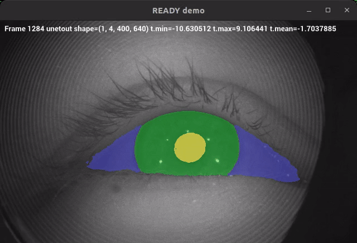

# Documentation

## Getting started
### Install [uv](https://github.com/astral-sh/uv): "An extremely fast Python package manager".
```
curl -LsSf https://astral.sh/uv/install.sh | sh
```

### Create venv
```
uv venv --python 3.12 # Create a virtual environment at .venv.
source .venv/bin/activate #To activate the virtual environment:
deactivate

#uv venv 2nd_env --python 3.13 #create with a diff python version
#rm -rf 2nd_env #to remove 2nd_env
```

### Install python package deps
```
uv pip install --editable . # Install the package in editable mode
uv pip install .[test]
uv pip install .[learning]
uv pip install .[model_optimisation]
uv pip install -e ".[test,learning,model_optimisation]" # Install the package in editable mode
#uv pip uninstall ready
```

### Debugging
```
source .venv/bin/activate #To activate the virtual environment:
export PYTHONPATH=. #$HOME/ready #$HOME/<ADD_REPO_PATH>
```

### Testing
```
python -m pytest -v -s tests/test_data_paths.py::test_mobious_dataset
python -m pytest -v -s tests/test_data_paths.py::test_mobious_dataset_labels

#TODO: Fix the following tests with data in the repo
python -m pytest -v -s tests/test_data_paths.py::test_txt
python -m pytest -v -s tests/test_data_paths.py::test_png
python -m pytest -v -s tests/test_data_paths.py::test_masks
python -m pytest -v -s tests/test_data_paths.py::test_tif_with_matplotlib
```

### Pre-commit
```
pre-commit run -a
```


## Demos
`READY` demo aplication ([ready.py](/src/ready/apis/holoscan/ready/python/ready.py)) is running in a local host LaptopGPU with NVIDIARTXA2000-8GB using local-built holoscan-sdk. 
[UNet](src/ready/models/unet.py) was trained in cricket with A100-40GB  and using [27.4K images of 1 channel](data/openEDS/README.md). 

| Animation | Data, Model(s), API |
| --- | --- |
|  **Fig.** Initial demo using UNET with OpenEDS datsets. Video has 3 frames copied 10 times to create a 30 frame per second video. | [DATA: OpenEDS](../data/openEDS);  [MODEL: UNET](../data/openEDS/models); [API: ready.py d98c497](https://github.com/UCL/ready/blob/d98c497392ba7d91e9218fa5b73c75c629e3d29b/src/ready/apis/holoscan/ready/python/ready.py)
|  **Fig.** Pupil segmentation was masked to compute its centroid values as coordinates. Centroid values for x are plotted as cummulative time series of 30 samples. Streamed video consist of different 6 frames copied 5 times to create a 30 frames per second video. | [DATA: OpenEDS](../data/openEDS); [MODEL: UNET](../data/openEDS/models);  [API: ready.py b44515a](https://github.com/UCL/ready/blob/b44515a70727620187f20ea19c50c77f4cacbad6/src/ready/apis/holoscan/ready/python/ready.py)  |

