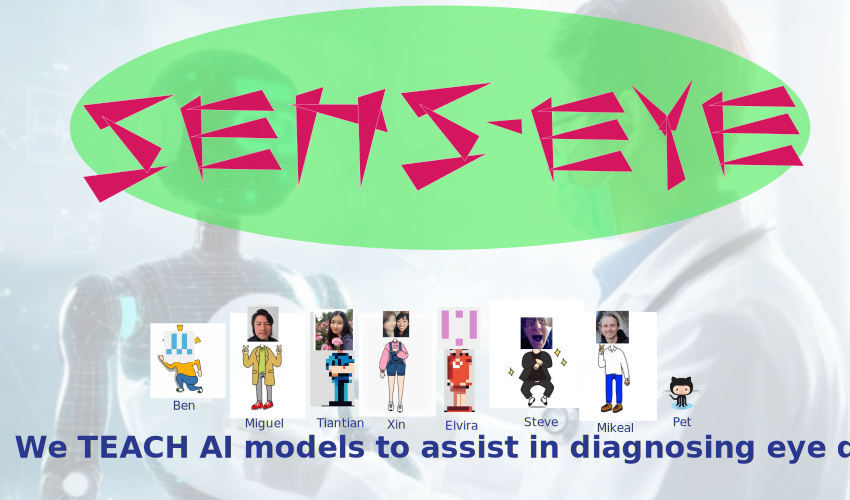

# :nut_and_bolt: Redefining Eye Tracking with Open-Source Real-Time AI Solutions :wrench: 

Hackathon hosted by Hawkes Institute    
6-8th November 2024    
https://cmic-ucl.github.io/CMICHACKS/



## :scroll: Project description
End to end real-time AI workflows are challenging due to the orchestration of various stages: (1) data acquisition, curation, labelling, postprocessing, (2) model train, validation, optimisation and deployment and (3) design of appropriate graphical user interfaces.

During two-days of hacking activities, instructors and participants aim to achieve four learning outcomes: (1) train and test light-weight UNET and UNET-ViT models for segmentation of the public MOBIOUS dataset using python-base libraries, (2) learn good software practices for contributing to open-source projects in compliance with medical device software standards (IEC 62304) using GitHub features, (3) optimise and deploy real-time models using NVIDIA’s AI sensor processing SDK for low latency streaming workflows (holoscan-sdk), and (4) work together to design a simple eye-tracking application or fun game that demonstrates the advantages of real-time AI workflows in analysing eye pathologies and movement.

Our goal is to bring together researchers, engineers, and clinicians from various departments to collaborate on hacking end-to-end real-time AI workflows, including development, evaluation, and integration. We also aim to foster collaborations and contributions that could lead to co-authorship in the development of our real-time AI workflow.


## :sparkles: Project organisers, collaborators, and participants
Lead organiser: [Miguel Xochicale](https://github.com/mxochicale) from Advanced Research Computing (ARC) Centre, UCL  
Co-organiser: [Stephen Thompson](https://github.com/thompson318) from Advanced Research Computing (ARC) Centre, UCL  

Collaborators: Diego Kaski at UCL Queen Square Institute of Neurology, Terence Leung at Dept of Med Phys & Biomedical Eng UCL, and Mikael Brudfors at NVIDIA     
Participants: Benjamin Duvieusart, Elvira Cortese, Tiantian He, Xin Zhao      

## :school: Registration and venue
Registration is free and you can get your tickets [here](https://www.eventbrite.co.uk/e/hawkes-hacks-tickets-1046969793837)

On Wednesday, these will be hosted at the UCL Hawkes Institute (formerly UCL Centre for Medical Image Computing (CMIC)), located at First Floor 90 High Holborn, WC1V 6LJ, London, UK. 

On Thursday and Friday, venue will be hosted at [The Wolfson Centre - UCL GOSICH google-maps](https://maps.app.goo.gl/JtJV32gxwovMXJ468). 
Rooms A, G and H at The Wolfson Centre - UCL GOSICH (UCL Great Ormond Street Institute of Child Health).
Room A is located in the Ground Floor and Rooms G and H in the First Floor.

On Thursday, the social activity will be held at The Lamb, a pub located at 94 Lamb's Conduit St, WC1N 1EA, London, UK.

## :date: Agenda
The following is a general agenda that may be subject to slight changes.

### Wednesday 6th Nov 2024
| Time  | Activity  | 
| --- |--- |
| 13:00 - 14:00 | Lunch break | 
| 14:00 - 14:15 | Welcome session | 
| 14:15 - 15:00 | Hacking: Introduction and preparation to hack [:link:](day00.md) | 
| 15:00 - 15:15 | Coffee break | 
| 15:15 - 17:30 | Hacking: Familiarize yourself with the data through unit testing [:link:](day00.md) | 
| 17:30 - onwards | Social | 

### Thursday 7th Nov 2024
| Time  | Activity  | 
| --- |--- |
| 09:00 – 10:30 | Hacking: Data augmentation [:link:](day01.md) |
| 10:30 - 10:45 | Coffee break | 
| 10:45 - 12:30 | Hacking: Model testing, training, and evaluation [:link:](day01.md) |
| 12:30 - 13:30 | Lunch break | 
| 13:30 - 15:00 | Hacking: Optimise, test, and deploy models on Clara AGX [:link:](day01.md) |
| 15:00 - 15:15 | Coffee break | 
| 15:15 - 17:00 | Hacking: Deploying models on NVIDIA Clara AGX  [:link:](day01.md)  | 
| 17:30 onwards | Social |

### Friday 8th Nov 2024
| Time  | Activity  | 
| --- |--- |
| 09:00 – 10:30 | Hacking: Deploying models on NVIDIA Clara AGX [:link:](day02.md) |
| 10:30 - 10:45 | Coffee break | 
| 10:45 - 12:30 | Hacking: Application design, testing, and evaluation [:link:](day02.md) |
| 12:30 - 13:30 | Lunch break | 
| 13:30 - 15:00 | Hacking: Application design, testing, and evaluation [:link:](day02.md) |
| 15:00 - 15:15 | Coffee break | 
| 15:15 - 16:30 | Hacking: Tidied up documentation and present results [:link:](day02.md)  | 
| 16:30 - 17:00 | Closing session  |


## :computer: Pre-requisites for participants  
* Participants are required to bring their own computers, either with a CPU or GPU. Computers with GPUs are ideal for prototyping models.
* We will also provide notebooks for prototyping models in Google Colab, which offers GPU support. A Google account will be required to access them.
* GitHub username (or [sign up](https://docs.github.com/en/get-started/signing-up-for-github/signing-up-for-a-new-github-account) for a GitHub account if you don’t have one).
* Generate your SSH keys by following the instructions provided [here](https://docs.github.com/en/authentication/connecting-to-github-with-ssh/generating-a-new-ssh-key-and-adding-it-to-the-ssh-agent).
* Open a terminal in your project directory (e.g., 'repositories') and clone the repository by entering or copying the following commands:
```
git clone git@github.com:UCL/ready.git
```

## :family: Forum
We are using [Discussions](https://github.com/UCL/ready/discussions) as a place to connect with other members of our community.
Ask questions you’re wondering about, share ideas, engage with other community members, welcome others and are open-minded. 
Remember that this is a community we build together 💪!
