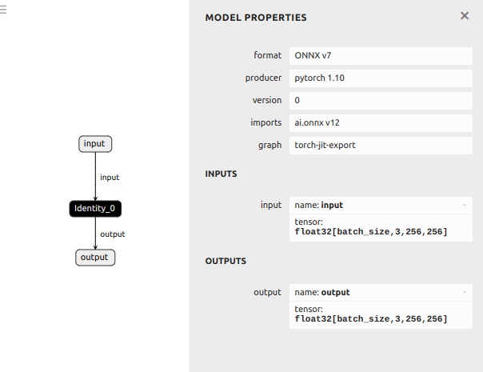

# APIS

## v4l2_camera

* On dev container
```
cd /workspace/volumes/ready/src/ready/apis/holoscan/v4l2_camera/python
python v4l2_camera.py
```

* On local device host
```
cd $HOME/Desktop/nystagmus-tracking/ready/src/ready/apis/holoscan/v4l2_camera/python/
vim -O v4l2_camera.py v4l2_camera.yaml
```

## Bring Your Own Model
This example shows how to run inference with Holoscan and provides a mechanism, to replace the existing identity model with another model.
* Identity ONNX model at `model/identity_model.onnx`



* Run app using your own repository in dev_container of clara-agx
```
cd /workspace/volumes/ready/src/ready/apis/holoscan/bring_your_own_model/python
python byom.py -d /workspace/volumes/ready/data/openEDS -m identity_model.onnx -l logger.log
#python byom.py -d /workspace/volumes/ready/data/openEDS -m model-5jul2024.onnx -l logger.log
#python byom.py -d /workspace/volumes/ready/data/openEDS -m model-5jul2024-sim.onnx -l logger.log
```

* Debug application in local host device
```
cd $HOME/Desktop/nystagmus-tracking/ready/src/ready/apis/holoscan/bring_your_own_model/python
vim -O byom.py byom.yaml ##Ctrl+WW to swap windows; :vertical resize 100
```


## Real-time AI segmentation
* Run app using your own repository in dev_container of clara-agx
```
cd /workspace/volumes/ready/src/ready/apis/holoscan/ready/python
clear && python ready.py -d /workspace/volumes/ready/data/openEDS -m model-5jul2024.onnx -l logger -df FALSE
clear && python ready.py -d /workspace/volumes/ready/data/openEDS -m model-5jul2024-sim.onnx -l logger.log -df TRUE
clear && python ready.py -d /workspace/volumes/ready/data/openEDS -m model-5jul2024-sim-BHWC.onnx -l logger.log -df TRUE
```

* Debug application in local host device
```
cd $HOME/Desktop/nystagmus-tracking/ready/src/ready/apis/holoscan/ready/python
vim -O ready.py ready.yaml ##Ctrl+WW to swap windows; :vertical resize 100
```

## References
* Visit the [SDK User Guide](https://docs.nvidia.com/holoscan/sdk-user-guide/examples/byom.html) for step-by-step documentation of this example.
* https://github.com/nvidia-holoscan/holoscan-sdk/tree/main/examples/bring_your_own_model 
