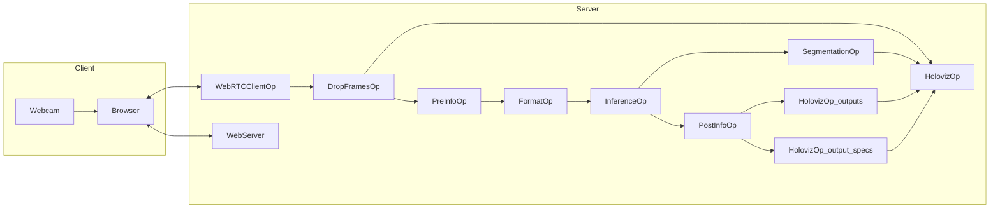

# WebRTC Video Client [:link:](https://github.com/nvidia-holoscan/holohub/tree/main/applications/webrtc_video_client)

## Create certificates to connect from a different machine

```bash
cd $HOME/datasets/ready
mkdir -p webrtc && cd webrtc
openssl req -new -newkey rsa:4096 -x509 -sha256 -days 365 -nodes -out MyCertificate.crt -keyout MyKey.key #JUST PRESS ENTER TO USE DEFAULT VALUES
```

## Launch dev container
```
cd $HOME/repositories/oocular/ready/docs/holoscan
bash launch_dev_container.bash
```

## Run application on `PUBLIC` network

* Launching `webrtc_client`
```bash
cd /workspace/volumes/ready/scripts/apis
#RECORDER FALSE
bash webrtc_ready.bash logger_webrtc_ready_tag.log PUBLIC DEGUG webrtc False
#RECORDER TRUE
bash webrtc_ready.bash logger_webrtc_ready_tag.log PUBLIC DEGUG webrtc True
```

* Check your host IP

Using `ifconfig` command in your terminal you can see a log like the following where the `000.000.0.000` is your YOU_HOST_IP.
```bash
$ifconfig
wlp0s20f3: flags=4163<UP,BROADCAST,RUNNING,MULTICAST>  mtu 1500
        inet 000.000.0.000 netmask 255.255.255.0  broadcast 000.00.0.000
```

* Open browser in your mobile phone or any device connect to the network
Go to `chrome://flags`, search for the flag `unsafely-treat-insecure-origin-as-secure`, enter the origin you want to treat as secure such as `http://{YOUR HOST IP}:8080`, enable the feature and relaunch the browser. See further details [here](https://github.com/nvidia-holoscan/holohub/tree/main/applications/webrtc_video_client).


* Stop and exit api
    * Stop streaming
    * Close api

* Replay recordings
```bash
#REPLAYER replayer_raw
bash webrtc_ready.bash logger_webrtc_ready_tag.log PUBLIC DEGUG replayer_raw False
#REPLAYER replayer_inference
bash webrtc_ready.bash logger_webrtc_ready_tag.log PUBLIC DEGUG replayer_inference False
```


## Run application on `LOCAL` network

* Launching `webrtc_client`
```bash
cd /workspace/volumes/ready/scripts/apis
#RECORDER FALSE
bash webrtc_ready.bash logger_webrtc_ready_tag.log LOCAL DEGUG webrtc False
#RECORDER TRUE
bash webrtc_ready.bash logger_webrtc_ready_tag.log LOCAL DEGUG webrtc True
```

* Open browser on local network
```bash
firefox http://127.0.0.1:8080/
```

* video-resolution: 320x240, 640x480, 960x540, 1280x720, 1920x1080
* video-codec: VP8, H264


* Stop and exit api
    * Stop streaming
    * Close api

* Replay recordings
```bash
#REPLAYER replayer_raw
bash webrtc_ready.bash logger_webrtc_ready_tag.log LOCAL DEGUG replayer_raw False
#REPLAYER replayer_inference
bash webrtc_ready.bash logger_webrtc_ready_tag.log LOCAL DEGUG replayer_inference False
```

## Useful commands

* USAGE of webrtc_ready.bash
```bash
bash webrtc_ready.bash <$1:LOGGER_NAME.log> <$2:NET: LOCAL/PUBLIC> <$3:HOLOSCAN_LOG_LEVEL: OFF/DEBUG/TRACE/INFO/ERROR> <$4:SOURCE: webrtc/replayer> <$5:ENABLE_RECORDING: True/False>
```

* Various commands
```bash
#KILL script
kill $(ps aux | grep "python webrtc_client.py" | awk '{print $2}')

#EDIT SCRIPTS LOCALLY
cd $HOME/repositories/oocular/ready/
vim configs/apis/config_webrtc_ready.yaml
vim scripts/apis/webrtc_ready.bash
vim src/ready/apis/holoscan/webrtc_ready/webrtc_client.py

## STOP dev container
docker stop $(docker ps -q | head -n 1) # choose the dev container ID from `docker ps` or get ids by using `$(docker ps -aq)`
```


## Graph structure for [webrtc_client.py](../../src/ready/apis/holoscan/webrtc/webrtc_client.py)

```mermaid
flowchart LR
    subgraph Server
        WebRTCClientOp --> DropFramesOp
        DropFramesOp --> HolovizOp
        DropFramesOp --> PreInfoOp
        PreInfoOp --> FormatOp
        FormatOp --> InferenceOp
        InferenceOp --> SegmentationOp
        SegmentationOp --> HolovizOp
        InferenceOp --> PostInfoOp
        PostInfoOp --> HolovizOp_outputs --> HolovizOp
        PostInfoOp --> HolovizOp_output_specs --> HolovizOp
        WebServer
    end
    subgraph Client
        Webcam --> Browser
        Browser <--> WebRTCClientOp
        Browser <--> WebServer
    end
```

See more [flow_benchmarking]( ../../data/webrtc/flow_benchmarking/)

