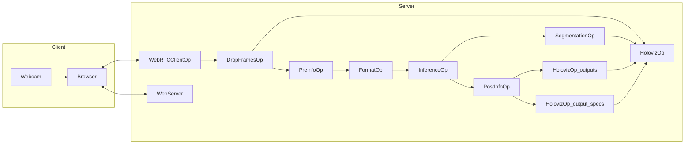

# WebRTC Video Client [:link:](https://github.com/nvidia-holoscan/holohub/tree/main/applications/webrtc_video_client)

Streams video from a browser (webcam) to a Holoscan pipeline over WebRTC, with optional recording and replay.

## Table of contents

- [Prerequisites](#prerequisites)
- [1. Generate certificates (for connecting from a different machine)](#1-generate-certificates-for-connecting-from-a-different-machine)
- [2. Configure the application](#2-configure-the-application)
- [3. Launch the dev container](#3-launch-the-dev-container)
- [4. Run on a `PUBLIC` network](#4-run-on-a-public-network)
- [5. Run on a `LOCAL` network](#5-run-on-a-local-network)
- [Script usage reference](#script-usage-reference)
- [Graph structure](#graph-structure-for-webrtc_clientpy)
- [Troubleshooting](#troubleshooting)

## Prerequisites

- Repository cloned at `$HOME/repositories/oocular/ready`
- Dataset directory available at `$HOME/datasets/ready`
- Docker installed, with the Holoscan dev container image available
- `openssl` installed (for certificate generation)

## 1. Generate certificates (for connecting from a different machine)

If you'll connect to the client from a device other than the host (e.g. your phone), generate a self-signed TLS certificate:

```bash
cd $HOME/datasets/ready
mkdir -p webrtc && cd webrtc
openssl req -new -newkey rsa:4096 -x509 -sha256 -days 365 -nodes \
  -out MyCertificate.crt -keyout MyKey.key
```

You'll be prompted for certificate details (Distinguished Name fields). It's safe to press **Enter** to accept the defaults for all of them:

```
.....+...++++++
-----
You are about to be asked to enter information that will be incorporated
into your certificate request.
What you are about to enter is what is called a Distinguished Name or a DN.
There are quite a few fields but you can leave some blank
For some fields there will be a default value,
If you enter '.', the field will be left blank.
-----
Country Name (2 letter code) [AU]:
State or Province Name (full name) [Some-State]:
Locality Name (eg, city) []:
Organization Name (eg, company) [Internet Widgits Pty Ltd]:
Organizational Unit Name (eg, section) []:
Common Name (e.g. server FQDN or YOUR name) []:
Email Address []:
```

## 2. Configure the application

Set the model and recording paths/filenames in the config file:

```bash
cd $HOME/repositories/oocular/ready/
vim configs/apis/config_webrtc_ready.yaml
```

## 3. Launch the dev container

```bash
cd $HOME/repositories/oocular/ready/docs/holoscan
bash launch_dev_container.bash
```

## 4. Run on a `PUBLIC` network

### 4.1 Launch the WebRTC client

```bash
# Recording disabled
bash /workspace/volumes/ready/scripts/apis/webrtc_ready.bash PUBLIC DEBUG webrtc False

# Recording enabled
bash /workspace/volumes/ready/scripts/apis/webrtc_ready.bash PUBLIC DEBUG webrtc True
```

### 4.2 Find your host IP

Run `ifconfig` on the host. The address on the `inet` line (`000.000.0.000` below) is your `{YOUR_HOST_IP}`:

```bash
$ ifconfig
wlp0s20f3: flags=4163<UP,BROADCAST,RUNNING,MULTICAST>  mtu 1500
        inet 000.000.0.000  netmask 255.255.255.0  broadcast 0.0.0.0
```

### 4.3 Connect from a browser

On your mobile phone (or any other device on the same network):

1. If using Chrome, go to `chrome://flags`, search for **`unsafely-treat-insecure-origin-as-secure`**, enter the origin you want to treat as secure — e.g. `http://{YOUR_HOST_IP}:8080` — enable the flag, and relaunch the browser. See the [upstream README](https://github.com/nvidia-holoscan/holohub/tree/main/applications/webrtc_video_client) for details.
2. Navigate to `http://{YOUR_HOST_IP}:8080/`.

### 4.4 Stop the pipeline

1. Press **Ctrl+D** in the terminal running the client.
2. In the browser UI, click **Stop**, then **Exit API**.

### 4.5 Replay recordings

```bash
# Raw replay
bash /workspace/volumes/ready/scripts/apis/webrtc_ready.bash PUBLIC DEBUG replayer_raw False

# Inference replay
bash /workspace/volumes/ready/scripts/apis/webrtc_ready.bash PUBLIC DEBUG replayer_inference False
```

## 5. Run on a `LOCAL` network

### 5.1 Launch the WebRTC client

```bash
# Recording disabled
bash /workspace/volumes/ready/scripts/apis/webrtc_ready.bash LOCAL DEBUG webrtc False

# Recording enabled
bash /workspace/volumes/ready/scripts/apis/webrtc_ready.bash LOCAL DEBUG webrtc True
```

### 5.2 Open the client in a browser

```bash
firefox http://127.0.0.1:8080/
```

Available settings in the UI:

- **Video resolution:** 320x240, 640x480, 960x540, 1280x720, 1920x1080
- **Video codec:** VP8, H264


### 5.3 Stop the pipeline

1. Click **Stop** to stop streaming.
2. Click **Exit API**.

### 5.4 Replay recordings

```bash
# Raw replay
bash /workspace/volumes/ready/scripts/apis/webrtc_ready.bash LOCAL DEBUG replayer_raw False

# Inference replay
bash /workspace/volumes/ready/scripts/apis/webrtc_ready.bash LOCAL DEBUG replayer_inference False
```

## Script usage reference

```bash
bash webrtc_ready.bash <$1:NET> <$2:HOLOSCAN_LOG_LEVEL> <$3:SOURCE> <$4:ENABLE_RECORDING>
```

| Arg | Name                   | Allowed values                         |
|-----|------------------------|-----------------------------------------|
| $1  | `NET`                  | `LOCAL`, `PUBLIC`                       |
| $2  | `HOLOSCAN_LOG_LEVEL`   | `OFF`, `DEBUG`, `TRACE`, `INFO`, `ERROR`|
| $3  | `SOURCE`               | `webrtc`, `replayer_raw`, `replayer_inference` |
| $4  | `ENABLE_RECORDING`     | `True`, `False`                         |

## Graph structure for [webrtc_client.py](../../src/ready/apis/holoscan/webrtc/webrtc_client.py)


```mermaid
flowchart LR
    subgraph Server
        WebRTCClientOp --> DropFramesOp
        DropFramesOp --> HolovizOp
        DropFramesOp --> PreInfoOp
        PreInfoOp --> FormatOp
        FormatOp --> InferenceOp
        InferenceOp --> SegmentationOp
        SegmentationOp --> HolovizOp
        InferenceOp --> PostInfoOp
        PostInfoOp --> HolovizOp_outputs --> HolovizOp
        PostInfoOp --> HolovizOp_output_specs --> HolovizOp
        WebServer
    end
    subgraph Client
        Webcam --> Browser
        Browser <--> WebRTCClientOp
        Browser <--> WebServer
    end
```

See also: [flow_benchmarking](../../data/webrtc/flow_benchmarking/)

## Troubleshooting

**Kill a stuck client process:**

```bash
kill $(ps aux | grep "python webrtc_client.py" | awk '{print $2}')
```

**Edit scripts locally:**

```bash
cd $HOME/repositories/oocular/ready/
vim scripts/apis/webrtc_ready.bash
vim src/ready/apis/holoscan/webrtc_ready/webrtc_client.py
```

**Stop the dev container:**

```bash
# Stops the first container in `docker ps`.
# If you have more than one container running, list IDs with `docker ps`
# (or `docker ps -aq` for all containers, including stopped ones) and
# target the correct one explicitly: docker stop <CONTAINER_ID>
docker stop $(docker ps -q | head -n 1)
```