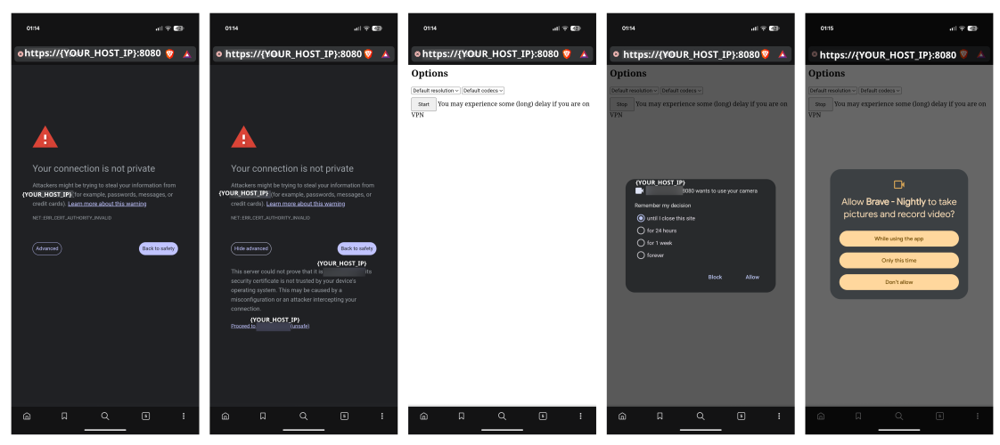
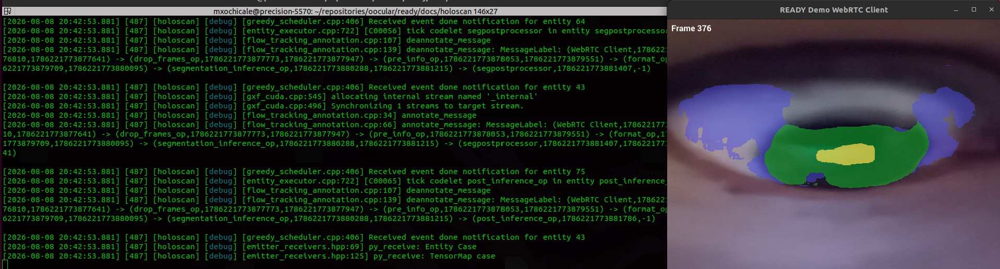
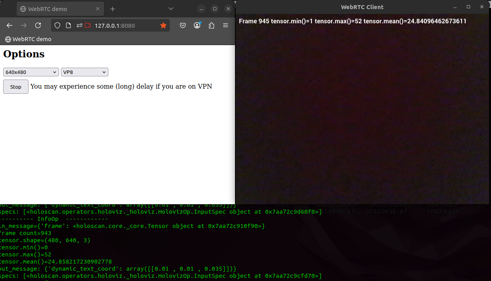
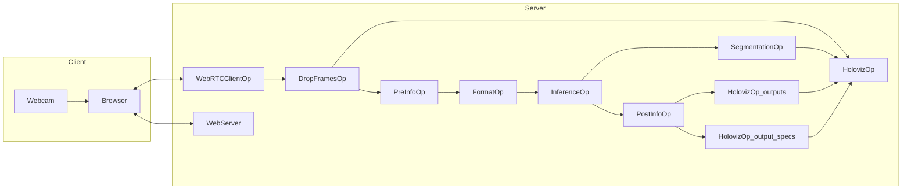

# WebRTC Video Client [:link:](https://github.com/nvidia-holoscan/holohub/tree/main/applications/webrtc_video_client)

Streams video from a browser (webcam) to a Holoscan pipeline over WebRTC, with optional recording and replay.

## Table of contents

- [Prerequisites](#prerequisites)
- [1. Generate certificates (for connecting from a different machine)](#1-generate-certificates-for-connecting-from-a-different-machine)
- [2. Configure the application](#2-configure-the-application)
- [3. Launch the dev container](#3-launch-the-dev-container)
- [4. Run on a `PUBLIC` network](#4-run-on-a-public-network)
- [5. Run on a `LOCAL` network](#5-run-on-a-local-network)
- [`webrtc_ready` script usage reference](#webrtc_readybash-script-usage-reference)
- [Graph structure](#graph-structure-for-webrtc_clientpy)
- [Troubleshooting](#troubleshooting)

## Prerequisites

- Repository cloned at `$HOME/repositories/oocular/ready`
- Dataset directory, including models available at `$HOME/datasets/ready`. See [mobious/models](../../data/mobious/models/)
    - You need to bind the required models and install the required dependencies and utils
- Docker installed, with the Holoscan dev container image available
- `openssl` installed (for certificate generation)
```bash
sudo apt-get install net-tools
```

## 1. Generate certificates (for connecting from a different machine)

If you'll connect to the client from a device other than the host (e.g. your phone), generate a self-signed TLS certificate:

```bash
cd $HOME/datasets/ready
mkdir -p webrtc && cd webrtc
openssl req -new -newkey rsa:4096 -x509 -sha256 -days 365 -nodes \
  -out MyCertificate.crt -keyout MyKey.key
```

You'll be prompted for certificate details (Distinguished Name fields). It's safe to press **Enter** to accept the defaults for all of them:

```
.....+...++++++
-----
You are about to be asked to enter information that will be incorporated
into your certificate request.
What you are about to enter is what is called a Distinguished Name or a DN.
There are quite a few fields but you can leave some blank
For some fields there will be a default value,
If you enter '.', the field will be left blank.
-----
Country Name (2 letter code) [AU]:
State or Province Name (full name) [Some-State]:
Locality Name (eg, city) []:
Organization Name (eg, company) [Internet Widgits Pty Ltd]:
Organizational Unit Name (eg, section) []:
Common Name (e.g. server FQDN or YOUR name) []:
Email Address []:
```

## 2. Configure the application

* Create `recordings` path otherwise you will get `: 'recorder_op' - Failed to open index_file_stream_ with error: GXF_FAILURE`
```bash
mkdir -p ~/datasets/ready/webrtc/recordings
```

* Set up Model bindings as shown in [model-dev](../../data/mobious/models/)

* Set the model and recording paths/filenames in the config file:

```bash
cd $HOME/repositories/oocular/ready/
vim configs/apis/config_webrtc_ready_template.yaml
vim configs/apis/config_webrtc_ready_poc_sep2026.yaml
#TODO https://github.com/oocular/ready/issues/137
```

## 3. Launch the dev container

```bash
cd $HOME/repositories/oocular/ready/docs/holoscan
bash launch_dev_container.bash
```

## 4. Run on a `PUBLIC` network

### 4.0 Create data path and edit config file

* Create `recordings` path otherwise you will get `: 'recorder_op' - Failed to open index_file_stream_ with error: GXF_FAILURE`
```bash
mkdir -p ~/datasets/ready/webrtc/recordings/ && cd ~/datasets/ready/webrtc/recordings
mkdir -p test_IDOOO test_IDOO1
```

* Edit file
```bash
#Setup config file
CONFIG_YAML=config_webrtc_ready_template.yaml
CONFIG_YAML=config_webrtc_ready_poc_sep2026.yaml
vim configs/apis/${CONFIG_YAML}
```

### 4.1 Launch the WebRTC client

```bash
# Setup config file
CONFIG_YAML=config_webrtc_ready_template.yaml
CONFIG_YAML=config_webrtc_ready_poc_sep2026.yaml

# Recording disabled
bash /workspace/volumes/ready/scripts/apis/webrtc_ready.bash ${CONFIG_YAML} PUBLIC DEBUG webrtc False

# Recording enabled
bash /workspace/volumes/ready/scripts/apis/webrtc_ready.bash ${CONFIG_YAML} PUBLIC DEBUG webrtc True
```

### 4.2 Find your host IP

Run `ifconfig` on the host. The address on the `inet` line (`000.000.0.000` below) is your `{YOUR_HOST_IP}`:

```bash
$ ifconfig
wlp0s20f3: flags=4163<UP,BROADCAST,RUNNING,MULTICAST>  mtu 1500
        inet 000.000.0.000  netmask 255.255.255.0  broadcast 0.0.0.0
```

### 4.3 Connect a browser to stream video from the mobile phone to the Holoscan server (device with GPU).

On your mobile phone (or any other device on the same network):

1. If using Chrome, go to `chrome://flags`, search for **`unsafely-treat-insecure-origin-as-secure`**, enter the origin you want to treat as secure — e.g. `https://{YOUR_HOST_IP}:8080` — enable the flag, and relaunch the browser. See the [upstream README](https://github.com/nvidia-holoscan/holohub/tree/main/applications/webrtc_video_client) for details.
2. Navigate to `https://{YOUR_HOST_IP}:8080/`.

The following figure shows screenshots of the Brave browser connected to the client at `https://{YOUR_HOST_IP}:8080/`. You will need to click through the browser's "not private" warning, since the certificate is self-signed, the browser cannot verify it against a trusted authority and flags the connection as unsafe. You will also need to grant the site camera permission, since the browser uses it to capture and stream video.




The figure below shows the terminal output with debug logs from `webrtc_client.py`, alongside the viewer window displaying the streamed video with segmentation overlay.



### 4.4 Stop the pipeline

1. Press **Ctrl+D** in the terminal running the client.
2. In the browser UI, click **Stop**, then **Exit API**.

### 4.5 Replay recordings

```bash
#Setup config file
CONFIG_YAML=config_webrtc_ready_template.yaml
CONFIG_YAML=config_webrtc_ready_poc_sep2026.yaml

# Raw replay
bash /workspace/volumes/ready/scripts/apis/webrtc_ready.bash ${CONFIG_YAML} PUBLIC DEBUG replayer_raw False

# Inference replay
bash /workspace/volumes/ready/scripts/apis/webrtc_ready.bash ${CONFIG_YAML} PUBLIC DEBUG replayer_inference False
```

## 5. Run on a `LOCAL` network

### 5.0 Launch the dev container (in case you start from LOCAL)

```bash
cd $HOME/repositories/oocular/ready/docs/holoscan
bash launch_dev_container.bash
```


### 5.0.1 Create data path and edit config file

* Create `recordings` path otherwise you will get `: 'recorder_op' - Failed to open index_file_stream_ with error: GXF_FAILURE`
```bash
mkdir -p ~/datasets/ready/webrtc/recordings/ && cd ~/datasets/ready/webrtc/recordings
mkdir -p test_IDOOO test_IDOO1
```

* Edit file
```bash
# Setup config file
CONFIG_YAML=config_webrtc_ready_template.yaml
vim configs/apis/${CONFIG_YAML}
```


### 5.1 Launch the WebRTC client via `webrtc_ready.bash`

```bash
#Setup config file
CONFIG_YAML=config_webrtc_ready_template.yaml

# Recording disabled
bash /workspace/volumes/ready/scripts/apis/webrtc_ready.bash ${CONFIG_YAML} LOCAL DEBUG webrtc False

# Recording enabled
bash /workspace/volumes/ready/scripts/apis/webrtc_ready.bash ${CONFIG_YAML} LOCAL DEBUG webrtc True
```

### 5.2 Open the client in a browser

```bash
firefox http://127.0.0.1:8080/
brave-browser-nightly --new-window http://127.0.0.1:8080/
```

Available settings in the UI:

- **Video resolution:** 320x240, 640x480, 960x540, 1280x720, 1920x1080
- **Video codec:** VP8, H264



### 5.3 Stop the pipeline

1. Press **Ctrl+D** in the terminal running the client.
2. In the browser UI, click **Stop**, then **Exit API**.

### 5.4 Replay recordings

```bash
#Setup config file
CONFIG_YAML=config_webrtc_ready_template.yaml

# Raw replay
bash /workspace/volumes/ready/scripts/apis/webrtc_ready.bash ${CONFIG_YAML} LOCAL DEBUG replayer_raw False

# Inference replay
bash /workspace/volumes/ready/scripts/apis/webrtc_ready.bash ${CONFIG_YAML} LOCAL DEBUG replayer_inference False
```

## `webrtc_ready.bash` script usage reference

```bash
bash webrtc_ready.bash <$1:NET> <$2:HOLOSCAN_LOG_LEVEL> <$3:SOURCE> <$4:ENABLE_RECORDING>
```

| Arg | Name                   | Allowed values                         |
|-----|------------------------|-----------------------------------------|
| $1  | `NET`                  | `${CONFIG_YAML}`                      |
| $2  | `NET`                  | `LOCAL`, `PUBLIC`                       |
| $3  | `HOLOSCAN_LOG_LEVEL`   | `OFF`, `DEBUG`, `TRACE`, `INFO`, `ERROR`|
| $4  | `SOURCE`               | `webrtc`, `replayer_raw`, `replayer_inference` |
| $5  | `ENABLE_RECORDING`     | `True`, `False`                         |

## Graph structure for [webrtc_client.py](../../src/ready/apis/holoscan/webrtc/webrtc_client.py)


```mermaid
flowchart LR
    subgraph Server
        WebRTCClientOp --> DropFramesOp
        DropFramesOp --> HolovizOp
        DropFramesOp --> PreInfoOp
        PreInfoOp --> FormatOp
        FormatOp --> InferenceOp
        InferenceOp --> SegmentationOp
        SegmentationOp --> HolovizOp
        InferenceOp --> PostInfoOp
        PostInfoOp --> HolovizOp_outputs --> HolovizOp
        PostInfoOp --> HolovizOp_output_specs --> HolovizOp
        WebServer
    end
    subgraph Client
        Webcam --> Browser
        Browser <--> WebRTCClientOp
        Browser <--> WebServer
    end
```

See also: [flow_benchmarking](../../data/webrtc/flow_benchmarking/)

## Troubleshooting

**Kill a stuck client process:**

```bash
kill $(ps aux | grep "python webrtc_client.py" | awk '{print $2}')
```

**Edit scripts locally:**

```bash
cd $HOME/repositories/oocular/ready/
vim scripts/apis/webrtc_ready.bash
vim src/ready/apis/holoscan/webrtc_ready/webrtc_client.py
```

**Stop the dev container:**

```bash
# Stops the first container in `docker ps`.
# If you have more than one container running, list IDs with `docker ps`
# (or `docker ps -aq` for all containers, including stopped ones) and
# target the correct one explicitly: docker stop <CONTAINER_ID>
docker stop $(docker ps -q | head -n 1)
```
