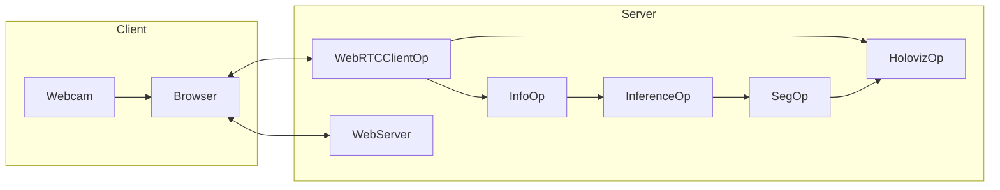

# WebRTC Video Client [:link:](https://github.com/nvidia-holoscan/holohub/tree/main/applications/webrtc_video_client)

## Launch dev container
```
cd $HOME/repositories/oocular/ready/docs/holoscan
bash launch_dev_container.bash
```

## Launch api
* Create certificates to connect from a different machine
```
cd $HOME/datasets/ready
mkdir webrtc && cd webrtc
openssl req -new -newkey rsa:4096 -x509 -sha256 -days 365 -nodes -out MyCertificate.crt -keyout MyKey.key #JUST PRESS ENTER
```

* Launching `webrtc_client`
```
cd /workspace/volumes/ready/scripts/apis
bash webrtc_ready.bash logger_webrtc_ready_tag.log LOCAL #PUBLIC
#edit scripts
vim webrtc_ready.bash
cd $HOME/repositories/oocular/ready/src/ready/apis/holoscan/webrtc_ready
```

* Application
	* Open browser on local network
	```
	firefox http://127.0.0.1:8080/
	```

	* video-resolution: 320x240, 640x480, 960x540, 1280x720, 1920x1080
	* video-codec: VP8, H264

	


* On a different machine
	* Check your host IP
	```
	$ifconfig
	wlp0s20f3: flags=4163<UP,BROADCAST,RUNNING,MULTICAST>  mtu 1500
	        inet {YOU_HOST_IP: 000.000.0.000}  netmask 255.255.255.0  broadcast 000.00.0.000
	```

	* Open browser
	Go to `chrome://flags`, search for the flag `unsafely-treat-insecure-origin-as-secure`, enter the origin you want to treat as secure such as `http://{YOUR HOST IP}:8080`, enable the feature and relaunch the browser. See further details [here](https://github.com/nvidia-holoscan/holohub/tree/main/applications/webrtc_video_client).


* Graph structure for [webrtc_client.py](../../src/ready/apis/holoscan/webrtc/webrtc_client.py)


See more [flow_benchmarking]( ../../data/webrtc/flow_benchmarking/)

