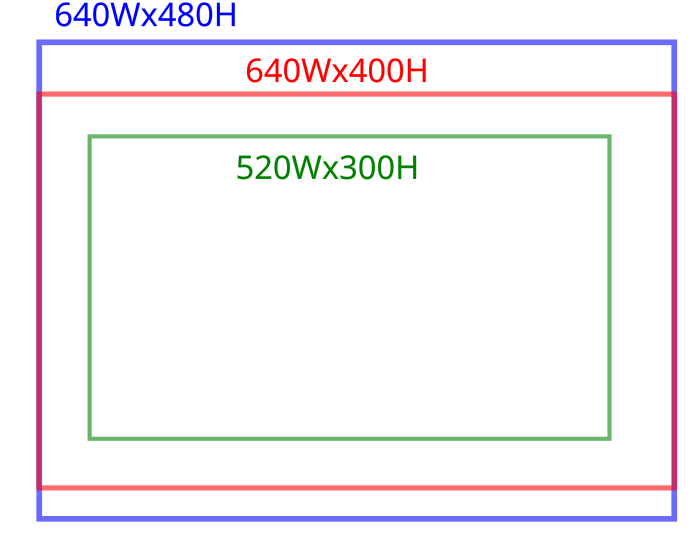

# Video Processing Pipeline
Convert and replay video recordings through the ready pipeline.

## 1. Convert_video_to_gxf_entities

### Launch the development container
```bash 
cd $HOME/repositories/oocular/ready/docs/holoscan 
bash launch_dev_container.bash 
```

### Replay recordings

* Edit config
```bash
## Terminal Outside the container 
# Change to repo path
cd $HOME/repositories/oocular/ready/
# Setup config file
CONFIG_YAML=config_webrtc_ready_template.yaml
# Edit file if needed
vim configs/apis/${CONFIG_YAML}
```

* Replay recordings
```bash
# Setup config file
CONFIG_YAML=config_webrtc_ready_template.yaml
CONFIG_YAML=config_webrtc_ready_poc_sep2026_postprocessing.yaml
# Setup flag for postprocessing
CODEPATH=/workspace/volumes/ready/configs/apis/
sed -i 's/^\([[:space:]]*\)postProcessed: "TRUE"/\1postProcessed: "FALSE"/g' ${CODEPATH}${CONFIG_YAML} 
grep -n 'postProcessed' ${CODEPATH}${CONFIG_YAML} #verify change to FALSE
# Raw replay
bash /workspace/volumes/ready/scripts/apis/webrtc_ready.bash ${CONFIG_YAML} LOCAL DEBUG replayer_raw False
# Inference replay
bash /workspace/volumes/ready/scripts/apis/webrtc_ready.bash ${CONFIG_YAML} LOCAL DEBUG replayer_inference False
```

### Convert gxf to mp4
```bash
bash /workspace/volumes/ready/scripts/video_processing/convert_gxf_entities_to_video.bash ${CONFIG_YAML}
```

## 2. Postprocess videos

The video processing step transforms raw camera input into a cropped and resized region of interest (ROI) suitable for downstream inference and streaming.

The diagram below illustrates the processing geometry:
* Blue rectangle, 640W × 480H: the native camera resolution.
* Red rectangle, 640W × 400H: the model input size.
* Green rectangle, 520W × 300H: the cropped and resized region of interest (ROI).



###  View the result
Play the generated MP4 with ffplay:
```bash
ffplay -vf \
    "drawtext=text='%{n}':x=10:y=10:fontsize=40:fontcolor=blue, \
    drawtext=text='%{pts\\:hms}':x=10:y=50:fontsize=40:fontcolor=blue" \
    -autoexit *.mp4
```

### Post process video
Setup `videoStartFrameTime` and `videoEndFrameTime` in ${CONFIG_YAML} from ffplay
```bash
bash /workspace/volumes/ready/scripts/video_processing/postprocessing.bash ${CONFIG_YAML}
``` 

## 3. Convert video to gxf entities
```bash
bash /workspace/volumes/ready/scripts/video_processing/convert_video_to_gxf_entities.bash ${CONFIG_YAML}
```

## 3. Replay a recording

### Set postProcessed flag to TRUE
```bash
sed -i 's/^\([[:space:]]*\)postProcessed: "FALSE"/\1postProcessed: "TRUE"/g' ${CODEPATH}${CONFIG_YAML} 
grep -n 'postProcessed' ${CODEPATH}${CONFIG_YAML} #verify change to TRUE
```

### Replay preprocessed video
```bash
bash /workspace/volumes/ready/scripts/apis/webrtc_ready.bash ${CONFIG_YAML} LOCAL DEBUG replayer_raw False
bash /workspace/volumes/ready/scripts/apis/webrtc_ready.bash ${CONFIG_YAML} LOCAL DEBUG replayer_inference False
```

## 4. Replaying videos

* Edit `CONFIG_YAML=config_webrtc_ready_poc_sep2026_postprocessing.yaml` by commenting and uncommenting lines for patients and tests.

* Run script `webrtc_ready.bash` with replayer_raw or replayer_inference
