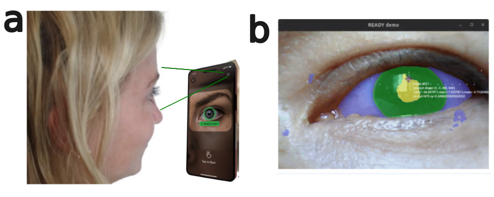

# Mobile-head-eye pose 

**Figure**. (a) The mobile phone camera should be pointed towards the respective eye at a distance of 2 to 3 cm, with natural lighting conditions. (b) Real-time segmented eye showing pupil (yellow), iris (green), sclera (purple), and tracking of the pupil with coordinates.

## References
* Lei, Yaxiong, Shijing He, Mohamed Khamis, and Juan Ye. "An end-to-end review of gaze estimation and its interactive applications on handheld mobile devices." ACM Computing Surveys 56, no. 2 (2023): 1-38. [google-citations](https://scholar.google.com/scholar?cites=5676980490466235464&as_sdt=2005&sciodt=0,5&hl=en)
* Cheng, Yihua, Haofei Wang, Yiwei Bao, and Feng Lu. "Appearance-based gaze estimation with deep learning: A review and benchmark." IEEE Transactions on Pattern Analysis and Machine Intelligence (2024). [google-citations](https://scholar.google.com/scholar?cites=1315563449260983834&as_sdt=2005&sciodt=0,5&hl=en)

